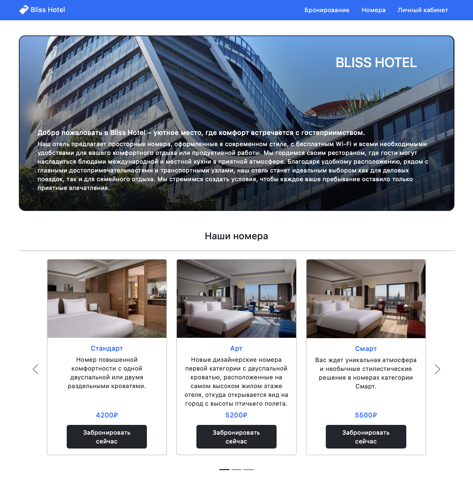
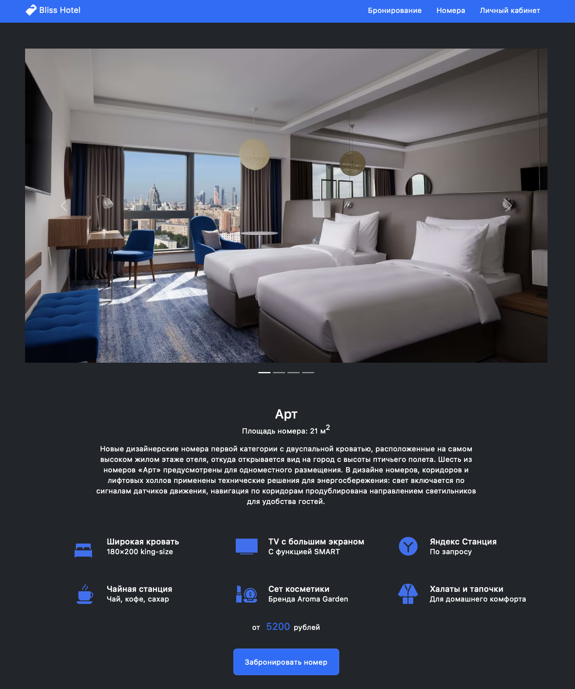
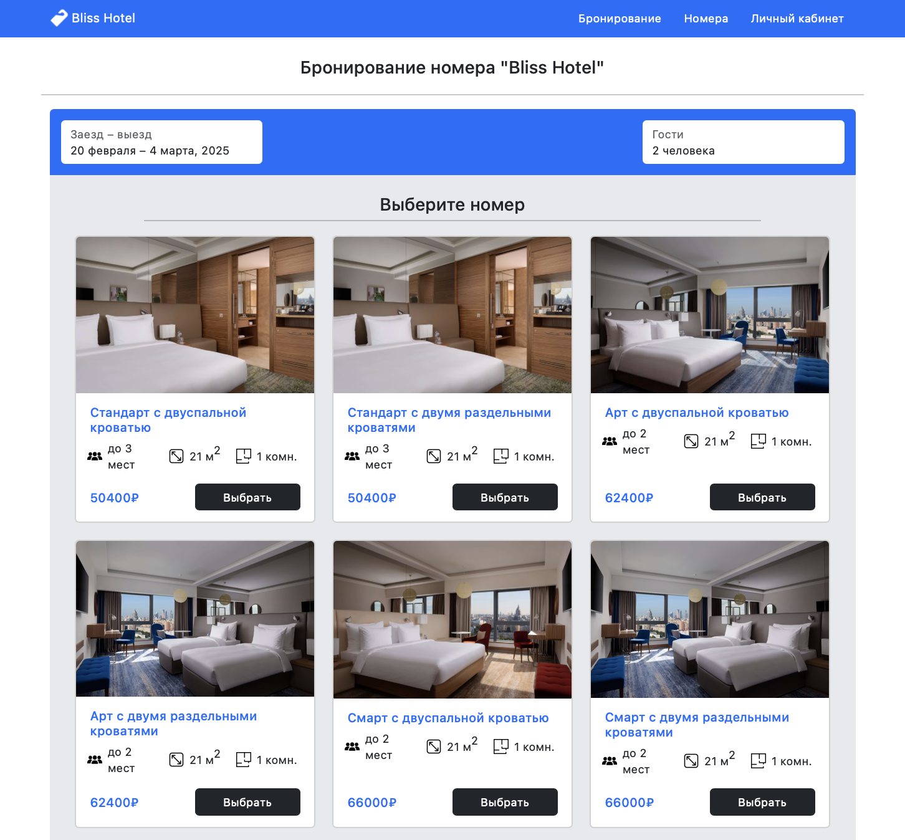
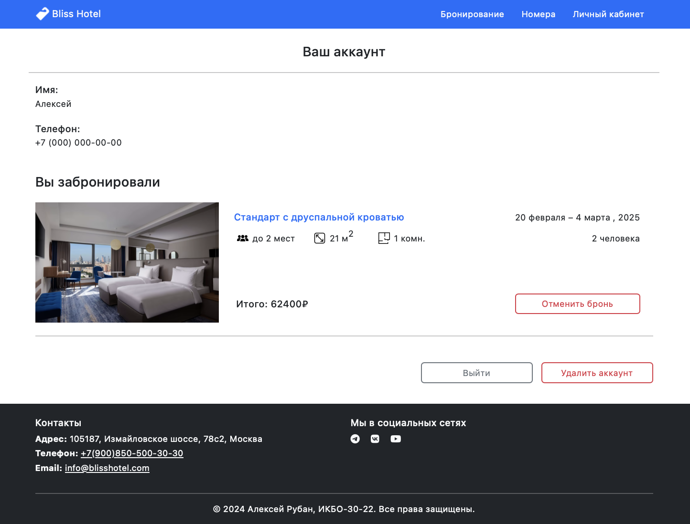

# BlissHotel - Spring Boot

## О проекте

**BlissHotel** — это монолитное веб-приложение для бронирования номеров в отеле. Оно предоставляет удобный интерфейс для просмотра номеров, их бронирования и управления учетной записью.

Веб-приложение доступно по ссылке: [https://blisshotel.armap-design.ru](https://blisshotel.armap-design.ru)

## Технологии

- **Backend:** `Java 21`, `Spring Boot`, `Spring Security`
- **Database:** `PostgreSQL`
- **Frontend:** `Thymeleaf`, `Bootstrap`
- **DevOps:** `Docker`, `Kubernetes`, `Nginx`
- **Архитектура:** `Monolith`, `MVC`, `Server-Side Rendering (SSR)`
- **API:** `REST API` для взаимодействия

## Функциональность

### Работа с номерами

- Просмотр списка всех номеров.
- Детальная страница номера с описанием и фотографиями.
- Бронирование номера по датам и количеству гостей.
- Отмена бронирований в личном кабинете.

### Аутентификация и аккаунт

- Регистрация по номеру телефона и коду из SMS.
- Вход в аккаунт по SMS-коду.
- Удаление аккаунта.

